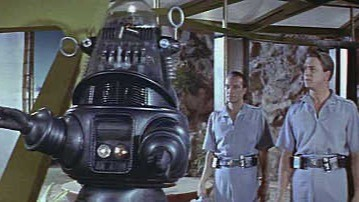

# The “Any Given Tuesday” Theory of AI Startups

By Robin Winters · First published February 21, 2026 · Republished October 2, 2026

[Original LinkedIn edition](https://www.linkedin.com/pulse/any-given-tuesday-theory-ai-startups-robin-winters-vnkgc/) · [Readable HTML edition](https://robinwinters.github.io/writing/any-given-tuesday-ai-startups.html) · [Robin’s portfolio](https://robin.ac/)

Original wording, images and captions. Technical observations and opinions retain their original context.

Cool robot on the outside, sad guy named Frank on the inside.

### If OpenAI shipped your core feature tomorrow, would your company still matter?

If the answer is no, then I'm sorry to tell you that you're building a temporary configuration layer, not a sustainable company/business.

What do I mean by that?

Temporary Configuration Layers are experiments waiting to be absorbed or erased.

There are really only two ways to stay afloat in the current AI Startup Ecosystem, barring pure R&D:

- Try to gain a user/customer base as rapidly as possible and hope that a foundation model/incumbent company buys you out.
- Or build something that uses AI functionality as a tool, not as a core feature.

I'm not saying give up and go home, but y'all need to read the landscape, do better PMF research, and see around corners a little better or be prepared to have your proverbial lunches eaten by the big players in this space.

### TL;DR:

On any given Tuesday, a foundation model company ships a patch. The observable effect is that your AI startup loses its differentiation, valuation, or vanishes entirely.

---

## Theory:

My "Theory of Everything" on the current state of the AI startup ecosystem goes a little something like this:

\*Read in your best David Attenborough voice

*In complex systems, small shifts at the base layer can produce disproportionate consequences at the surface. The AI startup ecosystem behaves no differently. The economy is an ecosystem, after all.*

*When a foundation model improves, application‑layer differentiation does not decline linearly. It collapses.*

---

## Caution:

Over the past few years, tons of well‑funded AI startups were built on the same flimsy foundation:

- A workflow layer
- Prompt orchestration
- Some light UX differentiation
- An API dependency on OpenAI, Anthropic, or Google

It works fine initially, then BOOM, the foundation model improves in a minor patch and suddenly the “core feature” is native.

### Exhibit A: Kite

Core Product: AI coding assistant integrated into developer IDEs.

Kite raised venture funding and built an early machine learning code completion engine years before GitHub Copilot.

Then OpenAI released Codex and Microsoft launched Copilot, powered by frontier scale foundation models trained on massive code corpora.

The intelligence layer moved beneath Kite.

By late 2022, Kite shut down entirely. The company cited the inability to compete with the scale and capital required to train frontier models.

### Exhibit B: Create (later rebranded as Anything)

Core Product: A profitable marketplace connecting startups with freelance software developers.

Then ChatGPT launched.

Suddenly the premise that coding required human intermediaries began to look temporary.

The founders shut the company down voluntarily in 2023 despite profitability, laid off staff, and rebuilt around generative AI.

### Exhibit C: Neeva

Core Product: Ad free subscription search engine with early AI summarization features.

When Microsoft integrated ChatGPT into Bing and Google accelerated Bard and Gemini, generative AI search moved directly into the incumbents’ distribution layer.

Neeva shut down its consumer search product in 2023 and was quickly acquired by Snowflake in what was widely regarded as a distressed outcome relative to its ambition and funding.

### Exhibit D: Woebot (terrible name, btw)

Core Product: Mental health therapy chatbot using scripted CBT conversations.

As large language models like GPT 4 and Claude made real time, human-like dialogue standard, scripted therapeutic chat felt structurally limited, aka bland and unhelpful.

Regulatory friction plus model advancement created a gap the company could not close.

Woebot shut down its original chatbot product after eight years.

### The "Any Given Tuesday" Effect:

1. A startup builds around a narrow AI capability.
2. Gains traction because the base models are imperfect.
3. Raises capital.
4. A foundation lab marginally improves the base capability.
5. The startup’s moat evaporates into a feature, or dries up entirely.

---

## Closing:

I wrote this down because I keep watching the same pattern repeat. Smart founders. Real capital. Real traction. Then a model update lands and the center of gravity shifts beneath them.

The wrapper phase feels like progress because revenue shows up fast and demos look *magical*. But the foundation layer is accelerating faster than most application-layer companies can adapt.

- Build where you own the data.
- Build where you own the workflow.
- Build where switching costs are real.
- Build where distribution compounds.

Foundation models will keep improving. Entire categories will keep compressing.

Build accordingly, and may the Force be with you.

🤘- Robin
