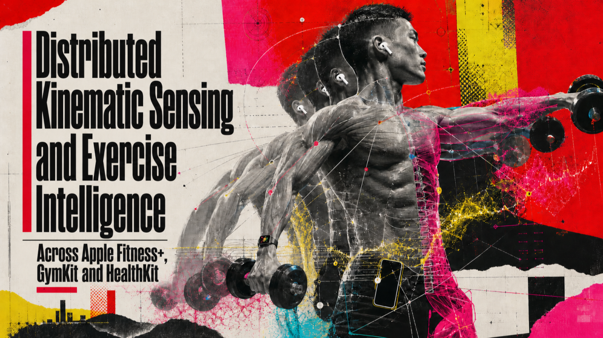
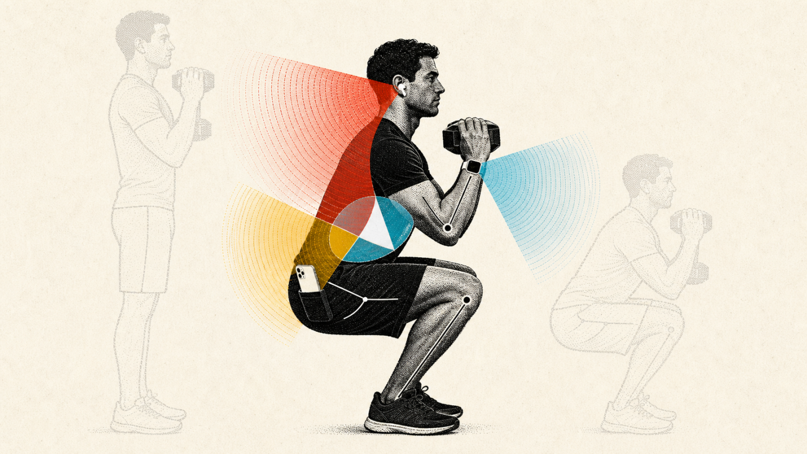
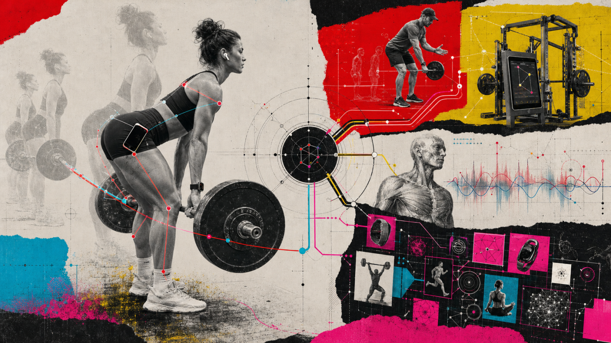

# Distributed Kinematic Sensing and Exercise Intelligence Across Apple Fitness+, GymKit and HealthKit

By Robin Winters · First published July 18, 2026 · Republished October 2, 2026

[Original LinkedIn edition](https://www.linkedin.com/pulse/distributed-kinematic-sensing-exercise-intelligence-across-winters-ek3ec/) · [Readable HTML edition](https://robinwinters.github.io/writing/distributed-kinematic-sensing.html) · [Robin’s portfolio](https://robin.ac/)

Original wording, images and captions. Technical observations and opinions retain their original context.

Really need to work on the title.

*By combining motion data from Apple Watch, AirPods, iPhone and connected gym equipment, Apple devs could make strength training as measurable as running or cycling.*

I've been a professional/competitive Bodybuilder for well over a decade now, and I'm constantly amazed at how difficult it is to find a more modern way of tracking my workouts. The vast majority of the fitness tracking ecosystem is primarily geared towards activities that involve some variation of a pedometer and a heart rate monitor. This works great for running or cycling, especially when you throw in a GPS tracker. However, the "Traditional Strength Training" side of fitness tracking is still primarily done manually in some form of zhuzhed up spreadsheet.

Don't get me wrong, I'm a big fan of spreadsheets. The internet itself is nothing more than an array of spreadsheets connected by a series of tubes, but I think we can do better than Lotus 1-2-3 in 2026.

What I'm proposing is basically a form of motion sensor triangulation across AirPods, Apple Watch, and iPhone, tied into GymKit, Fitness+, and HealthKit, sprinkled with Apple Intelligence framework to track and log movements commonly associated with "traditional strength training" aka Bodybuilding, so I don't have to log sets and reps simultaneously during my already demanding workouts.

By coordinating Apple Watch, motion capable AirPods and iPhone, supplementing them with workout programming and connected equipment, we can construct a body area sensing system capable of recognizing exercises, detecting sets, counting repetitions and relating mechanical work to physiological response.

---

 

Dumbbell Front Squat, for the curious.

## Distributed Sensing

The concept can be described as distributed kinematic sensing; several devices observe different portions of the body and contribute those observations to a shared movement model.

Apple Watch provides the clearest view of the hand and arm. Its accelerometer and gyroscope can measure wrist acceleration, rotation, orientation and repetition cadence. For curls, lateral raises, rows and presses, the wrist trajectory frequently contains enough information to identify repetition phases and estimate tempo.

The Watch also supplies physiological measurements such as heart rate and heart-rate recovery. It can therefore connect a movement with the body’s response to it.

AirPods provide a second anatomical reference point. Their motion sensors observe head orientation and movement, helping establish whether the user is standing, seated, hinged forward or lying down. This may help distinguish a standing shoulder press from a bench press, a seated curl from a standing curl or deliberate exercise from unrelated wrist movement.

AirPods Pro 3 make this role more interesting. Apple now sends AirPods heartrate and motion data to the iPhone during workouts. When AirPods Pro 3 and Apple Watch are worn together, Apple uses multiple heartrate streams and automatically selects the source with the highest confidence at that moment. [Apple’s AirPods workout documentation](https://support.apple.com/en-gb/123184)

> Collect overlapping measurements, estimate confidence and use the most reliable source for the current moment.

The iPhone could contribute in two distinct modes. When carried securely in a pocket, it becomes a sensor near the pelvis, making it useful for squats, lunges, deadlifts and step-ups. When positioned to observe the user, its camera could provide whole-body pose estimation, range-of-motion analysis and basic symmetry feedback.

An iPhone resting in a gym bag would contribute nothing. The system would need to determine whether the phone was operating in pocket mode, camera coach mode or not participating.

Apple already exposes much of the necessary plumbing through [Core Motion](https://developer.apple.com/documentation/coremotion/), [AirPods motion APIs](https://developer.apple.com/documentation/coremotion/cmheadphonemotionmanager) and [mirrored Watch–iPhone workout sessions](https://developer.apple.com/documentation/HealthKit/building-a-multidevice-workout-app).

---

 

When I move you move, just like that?

## Fitness+ has an enormous advantage

Automatic exercise recognition in an open gym is difficult because many movements look similar when observed from one point on the body. Reaching for a water bottle can resemble part of a curl. A front raise can resemble a shoulder press. A barbell squat may produce very little wrist movement.

Fitness+ changes the problem because the workout already has a script. During a Fitness+ session, Apple knows which exercise the trainer is demonstrating, when the interval begins, how long it should last and approximately how many repetitions are expected. It also knows whether the user should be standing, seated, supine or hinged.

The system no longer needs to ask, “Which of hundreds of exercises is this?” It can ask, “Is the user currently performing the expected squat, and where are the repetition boundaries?”

This prior knowledge should make recognition substantially more reliable. It could support live observations such as:

- “Rep 8 of 12”
- “Two repetitions behind the trainer”
- “Your range of motion shortened during the last three reps”
- “Your eccentric phase is faster than the previous set”
- “Your heart rate recovered 18 beats during this rest period”

The experience should remain confidence aware. A low confidence estimate should not be presented as indisputable fact. Fitness+ could display a tentative count or defer confirmation until the rest period.

### The Open Gym version

Outside Fitness+, the system could use a progressively assisted workflow.

A user might begin by selecting a saved routine or naming an exercise with Siri. Once the exercise is known, Apple Watch could detect the beginning and end of each set, count repetitions and measure tempo automatically.

If no exercise was selected, the system could propose one after observing the movement:

> “Looks like 10 incline dumbbell curls. Correct?”

High confidence sets could be committed automatically. Low confidence detections could remain suggestions. Correcting an exercise would provide an individualized calibration signal, allowing the system to learn the user’s preferred movements, wrist placement and equipment.

A practical processing pipeline would contain several stages:

1. **Activity segmentation:** Separate exercise from walking, equipment setup and rest.
2. **Posture inference:** Use head, wrist and pelvis orientation to estimate body position.
3. **Exercise classification:** Compare the observed movement with the routine, Fitness+ timeline and trained exercise library.
4. **Rep phase detection:** Identify concentric, transition and eccentric phases.
5. **Confidence estimation:** Decide whether to save, suggest or request confirmation.
6. **Physiological association:** Relate each set to heart rate, recovery and perceived effort.

On device processing would allow raw motion and camera data to remain local. Only the derived workout record would need to enter HealthKit.

### This is already an active product category

Automatic strength tracking is not an untouched field. Several companies already offer parts of the proposed experience.

[Sonar Fit](https://apps.apple.com/us/app/sonar-fit/id6740939129) uses Apple Watch or AirPods Pro motion sensors to count repetitions, detect sets and begin rest timers. It specifically describes using AirPods for head motion tracking and permits users to train with the Watch, AirPods or both.

[HealthBuddy](https://gethealthbuddy.com/) also uses an on device movement model that reads accelerometer and gyroscope data from AirPods and Apple Watch. It performs live rep counting and connects with Apple Health.

Neither product publicly explains whether Watch and AirPods data are combined into one confidence weighted movement model or primarily operate as alternative input sources. Neither presents the wider Fitness+, GymKit, standardized strength data and Vitals architecture proposed here.

[Train Fitness](https://www.trainfitness.ai/) demonstrates how far wrist only recognition has progressed. The company claims automatic detection of more than 470 exercises, along with rep, acceleration, velocity and tempo tracking using smartwatch movement.

Garmin has offered automatic rep counting, set detection and exercise identification in its Strength profile for years. Its own documentation acknowledges the need for users to correct counts when necessary. [Garmin’s rep-counting documentation](https://support.garmin.com/en-SG/?faq=xEPSpxE3j27gpEsiq8K9o8)

WHOOP has approached the problem from another direction. Its Strength Trainer uses inertial motion, biomechanics and cardiovascular data to estimate muscular load and incorporate it into Strain and Recovery. For the most precise calculation, users enter exercises, sets, repetitions and weight; its hands-off mode estimates muscular demand from movement profiles and heart rate. [WHOOP’s Strength Trainer research](https://www.whoop.com/us/en/thelocker/the-research-and-development-behind-strength-trainer/)

Connected gyms such as Tonal and Tempo solve the sensing problem by controlling the environment. Tonal measures cable displacement and resistance while tracking pace, range, symmetry and repetitions; Tonal 2 adds camera-based analysis. Tempo uses iPhone based computer vision and recognizable weights to provide rep counting and guidance. These systems can produce richer measurements, but only within their respective equipment ecosystems. [Tonal’s coaching system](https://knowledge.tonal.com/kb/guide/en/coaching-cues-9XTywueFNJ/Steps/3954702), [Tempo’s iPhone-based system](https://tempo.fit/blog/introducing-the-tempo-move)

The market has therefore produced many of the pieces. What it has not produced is a shared platform that makes those pieces interoperable.

### Google has patented the earbud-plus-watch concept

Google’s patent portfolio contains a particularly relevant example.

Its system receives motion data from two wearable devices, explicitly suggesting that the first may be an earbud and the second a smartwatch. Multiple inertial streams are processed to determine exercise types and repetitions. The European patent was granted in March 2025 and is currently listed as active. [Google’s exercise-recognition patent](https://patents.google.com/patent/EP3973448A1/en)

This is strong evidence that distributed ear/wrist exercise recognition has been considered at a serious engineering level.

It also means that combining earbud and smartwatch IMUs should not be characterized as an entirely new invention. The more differentiated question is how Apple could turn distributed sensing into a coherent platform experience.

### Apple has contemplated much of the larger system

Apple’s own pending patent application, **“Detecting and Tracking a Workout Using Sensors,”** was published in March 2025.

It describes a system capable of:

- Identifying specific strength exercises
- Counting repetitions and sets
- Detecting incomplete repetitions
- Combining computer vision with smartwatch IMU data
- Receiving data from smartphones, heart-rate monitors and external sensors
- Detecting work and rest periods
- Adjusting rest guidance using heart rate or respiration
- Identifying weights through computer vision and OCR
- Receiving equipment data through RFID, NFC, Bluetooth or Wi-Fi
- Detecting selector-pin positions and calculating barbell plate loads

The application is heavily oriented toward a head mounted spatial computing device (can't image what that might be /s) but its supporting sensor network closely resembles the broader architecture considered here. [Apple’s workout-tracking patent](https://patents.google.com/patent/US20250099814A1/en)

A patent does not guarantee that a product will ship. It does, however, demonstrate that Apple has considered automatic strength recognition, rep counting, weight identification and cross-device sensing in a unified system.

---

 

How is the phone staying connected to her hip?

## What the research says

Researchers have studied exercise recognition and repetition counting from wearable inertial sensors for more than a decade. Results can be impressive for movements that produce distinct trajectories, but accuracy varies significantly by exercise and sensor location.

One study evaluated sensors worn at the chest, upper arm, wrist and ear. The chest-mounted sensor performed best, while the ear-mounted sensor performed worst by itself. [ExerSense study](https://pmc.ncbi.nlm.nih.gov/articles/PMC7795271/)

That supports a "Division of responsibility". AirPods should normally serve as contextual evidence rather than the universal primary rep counter. Their value lies in helping the system understand posture and body motion when Apple Watch sees only the wrist.

Other Apple Watch research has achieved promising exercise recognition and repetition counting results, although bench press has proven more difficult than squats or deadlifts in some evaluations. [Smartwatch strength-training validation study](https://pmc.ncbi.nlm.nih.gov/articles/PMC8471343/)

No individual sensor should be expected to understand every exercise. The benefit of distributed sensing is that the system can degrade gracefully:

- A curl may be counted primarily by the Watch.
- A squat may rely more heavily on the pocketed iPhone.
- A bench press may combine Watch motion with AirPods posture.
- A camera-enabled session may override uncertain inertial estimates with pose information.
- A connected machine may directly report movement and resistance.

### The resistance problem

One measurement remains difficult to infer from body motion alone: the actual weight being lifted.

A slow repetition could indicate a heavy load, intentional tempo, accumulated fatigue or an inexperienced lifter. None of those possibilities can be distinguished reliably from rep velocity alone.

Resistance must therefore come from another source:

- User input
- A remembered previous load with quick confirmation
- Computer vision reading a dumbbell, plate or selector stack
- NFC or QR identification
- A connected cable machine, rack or smart weight
- A strength-oriented extension of GymKit

Apple’s patent explicitly discusses visual weight recognition, selector pins, RFID, NFC and wireless equipment communication. That validates the importance of the equipment layer. I personally think that NFC and QR/RFID weights would be a huge step in the right direction, and would be fairly trivial to implement; NFC stickers applied to free weights or plate loaded machines, etc etc.

A future GymKit for strength equipment could communicate:

- Equipment and exercise identity
- Selected resistance
- Cable or lever displacement
- Rep velocity
- Range of motion
- Left/right force or displacement
- Seat and handle configuration
- Weight changes during drop sets

### HealthKit needs a strength training data model

HealthKit recognizes traditionalStrengthTraining as an activity type for machine and free-weight exercise. It also permits custom metadata to be associated with workouts. But it does not currently offer a standardized, interoperable schema for strength training structure.

An application can record sets and reps through custom metadata, but another application may not understand what those fields mean. [HealthKit workout metadata](https://developer.apple.com/documentation/healthkit/workout-metadata-keys) demonstrates both the available foundation and the limitation.

A native strength representation should be hierarchical:

> Workout → Exercise → Set → Repetition

An exercise record could contain:

- Exercise identity and variation
- Equipment
- Primary movement pattern
- Targeted muscle groups
- Confidence and provenance

A set could contain:

- Resistance
- Repetitions
- Set type
- Duration
- Rest interval
- Perceived effort

Individual repetitions could optionally include:

- Concentric and eccentric duration
- Range of motion
- Velocity
- Completion quality
- Sensor confidence

This would allow Fitness+, third party workout apps, connected gym equipment and coaching platforms to exchange strength data rather than reducing an entire session to duration and calories.

### Connecting mechanical work to Vitals

The Vitals app is primarily based on overnight measurements such as heart rate, respiratory rate, wrist temperature and sleep duration. Those signals should not be used to detect repetitions. Their value is as recovery context. [Apple’s Vitals documentation](https://support.apple.com/en-in/guide/watch/apd15aa7ed96/watchos)

The more useful relationship is:

> Overnight baseline → planned workout → measured sets and resistance → effort score → recovery trend

HealthKit already supports perceived and estimated workout effort, while Apple’s training-load system compares recent workout intensity and duration with longer term activity. [HealthKit effort support](https://developer.apple.com/documentation/Updates/HealthKit)

Duration alone is an incomplete description of strength training. Fortyfive minutes might contain a light circuit, a heavy squat session or more conversation than lifting.

A record of 14 working sets, 8,200 pounds of total volume and declining concentric velocity provides much richer context. It would help training load reflect the work performed rather than merely how long the workout app remained active.

WHOOP’s muscular load model demonstrates demand for precisely this connection. Apple could go further by combining mechanical records, workout effort and overnight trends within HealthKit.

### A realistic product roadmap

The strongest first gen product would begin with Apple Watch and a known workout plan. Fitness+ sessions, saved routines and user-selected exercises would provide the expected movement. The Watch would detect repetition timing. AirPods would help establish posture. The iPhone could optionally contribute pelvis motion or camera pose.

The progression might look like this:

### Phase one: Fitness+ intelligence

- Known exercise and interval
- Watch based rep counting
- Automatic set timing
- AirPods posture confirmation
- Live tempo and range consistency

### Phase two: Structured open gym workouts

- User selected routines
- Automatic set detection
- Suggested exercise corrections
- Remembered resistance
- Training volume and effort summaries

### Phase three: Freeform recognition

- Automatic exercise classification
- Personalized movement calibration
- Confidence aware confirmations
- Pocket and camera modes for iPhone

### Phase four: Connected strength equipment

- GymKit resistance and equipment identity
- Machine configuration
- Cable or bar velocity
- Standardized HealthKit set and rep record

---

 

Straight Leg Deadlifts with about a buck'80 in plates is no joke

Smartwatches already count repetitions. AirPods based apps already estimate strength movement. WHOOP models muscular load. Tonal measures resistance and cable displacement. Tempo uses iPhone computer vision. Google has patented earbud + watch exercise recognition. Apple has patented a wider system involving computer vision, smartwatch motion, automatic rep counting and equipment identification.

Apple owns the Watch, AirPods, iPhone, Fitness+, Workout, HealthKit and GymKit. It also controls the privacy, synchronization and on device processing layers required to unify exercise recognition, distributed sensing, equipment telemetry and physiological recovery into a single first party platform.

This could transform Traditional Strength Training from a timer with a heartrate graph into a computational record of what the athlete actually did and give strength training the same depth of measurement Apple already brings to running and cycling.

🤘Robin
