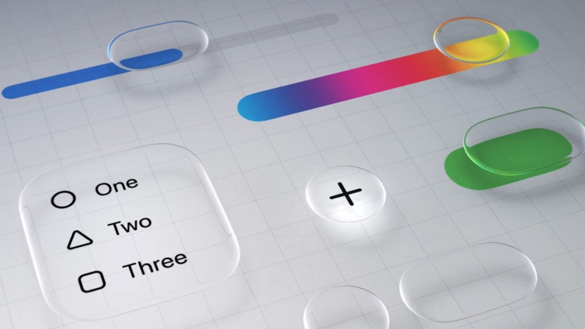
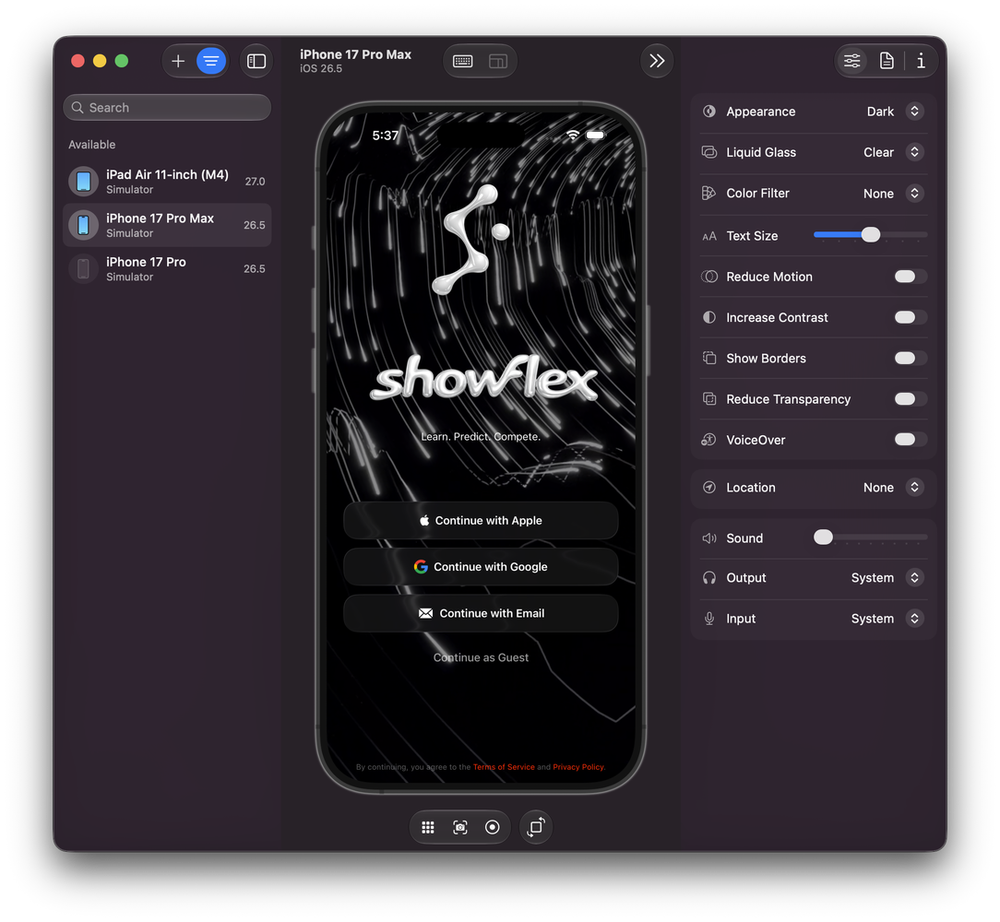

# In iOS 27 and Xcode 27 Liquid Glass will be applied to your app automatically.

By Robin Winters · First published June 30, 2026 · Republished October 2, 2026

[Original LinkedIn edition](https://www.linkedin.com/pulse/ios-27-xcode-liquid-glass-applied-your-app-robin-winters-mcxnc/) · [Readable HTML edition](https://robinwinters.github.io/writing/ios-27-liquid-glass.html) · [Robin’s portfolio](https://robin.ac/)

Original wording, images and captions. Technical observations and opinions retain their original context.

Apple's Liquid Glass Design Language

The grace period for opting out is over and Liquid Glass will be applied to your app automatically, like it or not.

In all honesty I didn't really understand Liquid Glass when it was announced at dub dub last year. However, after several developer events including "one on one's" and lab appointments at Apple campus, I've come around to it.

Below is a somewhat impromptu look at how I've implemented Liquid Glass into my projects. Important to note that I'm usually running the developer beta of whatever I'm building for/in, including Xcode, and things are subject to change before public updates go out. CYA.

---

Like a lot of other devs, I've been tinkering with all the new fine tuning features in iOS/Xcode 27, and there's a LOT to go over. Most importantly, imo, is the Device Hub.

 

It's...glorious.

Not to gush, but the Device Hub has been on many a wish list and Apple delivered. Testing is one of my favorite things to do during the development process, and being able to visually poke at UI/UX across devices and OS iterations, and tweaking the accessibility features is just "Chef's Kiss" for me.

Anyway!

I've tried to use Liquid Glass as minimally as possible. As a design principle, I want the UI to get out of the user's way so the content and UX are the primary focus. For ShowFlex, the strongest use is in the global navigation layer. The floating header orb and bottom tab bar use **GlassEffectContainer**, circular **.glassEffect**, **glassEffectID**, and matched geometry so the app’s primary controls behave like native system surfaces. The controls sit above constantly changing content. Event/News feeds, rosters, athlete cards, event details, and social views. Liquid Glass lets the chrome hangout in reach without becoming heavy, and it gives taps, expansion, collapse, and selection changes a physical feel.

[Watch this video in the original LinkedIn article](https://www.linkedin.com/pulse/ios-27-xcode-liquid-glass-applied-your-app-robin-winters-mcxnc/)

I call it "Bloopy"

I try to not overuse it. Dense content surfaces, especially the athlete lineup cards in the above video from the app, often keep a stable filled background and add a lighter custom glass edge treatment instead of full translucency, but the clear material modifier looks pretty cool with bright colors and patterns passing underneath it. Adjust as needed, especially using/testing with Device Hub, to keep things readable and fast in scan heavy areas while still giving the product the same polished visual vocabulary. For more focused surfaces like auth gates, I used native glass more directly b/c those elements benefit from a stronger sense of elevation and touchability. "Touchability" is a word now, just like "Bloopy" which is what I call the animation effect for the tab bar at the bottom of the screen.

It's basically a question of hierarchy. Glass marks interactive surfaces as touchable, while content cards stay legible. Interactive glass is mostly reserved for things the user acts on like passive surfaces using regular glass or edge highlights.

There’s also a shared adapter layer **sfGlass** applies native **.glassEffect** and keeps an **.ultraThinMaterial** fallback for older probes. That wrapper is used for practical control surfaces like search bars and sheets. A custom **liquidGlassEdge** and **lightweightLiquidGlassEdge** modifiers keep the existing solid card background, then add rim/highlight treatment for depth without making dense list content fully translucent.

[Watch this video in the original LinkedIn article](https://www.linkedin.com/pulse/ios-27-xcode-liquid-glass-applied-your-app-robin-winters-mcxnc/)

Auth screen

On the main auth screen Liquid Glass is used as the control layer over a video backdrop. It renders a looping video background, darkens it with a black overlay, then places the branding and auth controls directly on top, letting the screen feel cinematic while the glass controls pick up the background motion/material instead of hiding it. I think about it like applying an optical illusion to a control surface so we're not blocking the action going on in the back, but also keeping the layers separate.

That's it for now!

Apple says pretty specifically to not overuse the material modifier and to use native as much as possible. Group menus and effects so rendering doesn't bog the device down, and keep in mind the accessibility features as they can fundamentally change the UI/UX. Use Device Hub and Instruments to pick out and shave off hangs and root out resource hogs. Biggest takeaway: Less is more. Get out of the user's way and let the device do the work with native implementations over custom jobs.

Build accordingly and have fun!

🤘Robin
