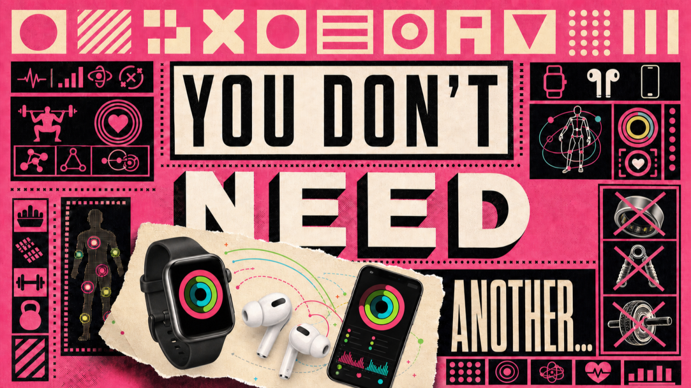
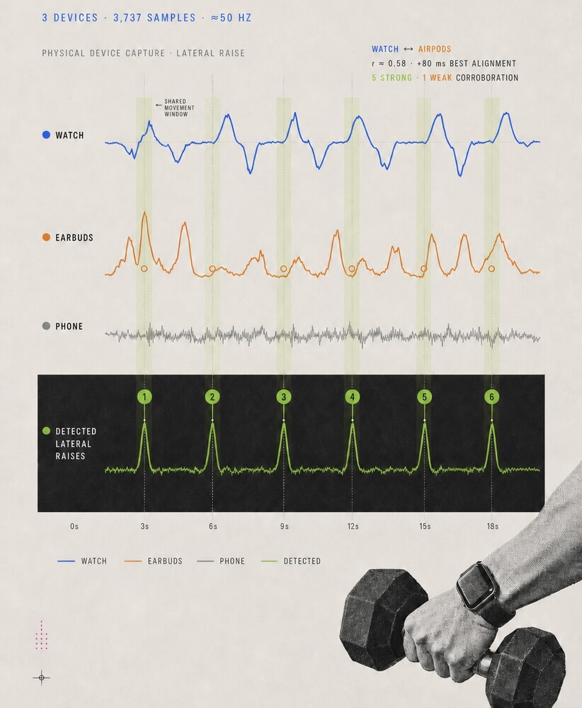
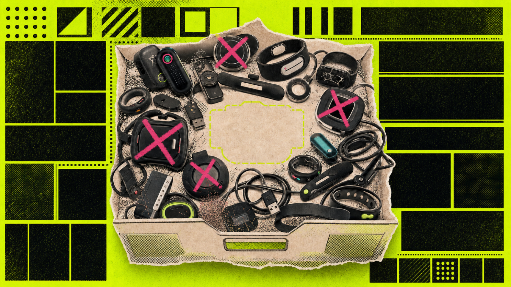

# Kinematics Lab Part II: You Don't Need Another...

By Robin Winters · First published July 30, 2026 · Republished October 2, 2026

[Original LinkedIn edition](https://www.linkedin.com/pulse/kinematics-lab-part-ii-you-dont-need-another-robin-winters-lrybc/) · [Readable HTML edition](https://robinwinters.github.io/writing/kinematics-lab-part-ii.html) · [Robin’s portfolio](https://robin.ac/)

Original wording, images and captions. Technical observations and opinions retain their original context.

FitTech Has a Junk Drawer Problem

As stated in the previous article, the premise behind my Kinematics project is proving that Apple may already have enough sensors in the right places to make strength training more legible.

In most cases the answer to the question of how best to automagically capture and log Traditional Strength Training data is not another device, but rather better coordination between the devices already in the room. For millions of people that means Apple Watch, AirPods, and iPhone.

Treadmills and ellipticals, like most cardio training, generate machine readable workouts because the movement is repetitive and/or already instrumented. Strength Training is...messier. A set of alternating dumbbell curls may contain 16 separate arm events, only half of which happen on the arm/wrist wearing a device capable of capturing fitness data. A squat may be dominated by hips, knees, glute position, and load, while the wrist contributes stability but are otherwise static and nearly invisible to a fitness app. In Apple Fitness+ most of this mechanical work collapses into Traditional Strength Training, but users/athletes still have to manually log sets, reps and gauge difficulty based on how sweaty they are at the end of a workout.

I think I can build something better that doesn't require buying any new equipment or FitTech gadgetry.

---

 

Waves, y'all. Waves.

### The Useful Sets & The Not So Useful Sets

My first useful physical capture was a normal set of dumbbell lateral raises where the exported session contained 3,737 sensor samples from the cross device application I've built for utilizing the metrics captured from primarily the gyroscopes/motion sensing on Apple Watch, iPhone, and AirPods.

- Apple Watch: 916 samples
- AirPods: 1,406 samples
- iPhone: 1,415 samples

The Watch stream was complete and close to the requested 50 Hz capture rate. A deterministic Apple Watch first detector found reps from the dominant wrist rotation signal pretty easily. The interesting bit was that the AirPods trace overlapped with the Watch trace, which is what I was aiming for. The zero lag correlation was roughly 0.58, and the best alignment improved slightly when AirPods lagged by about 80 milliseconds.

The next set of tests were alternating dumbbell curls that broke the demo. It *should* have been the better demo, however the alternating curls expose the weakness of a single wrist sensor. If the watch is on the left wrist it obviously observes the left arm better than the right. The other arm has to be inferred through rhythm, torso response, AirPods motion, timing, or user correction, which is what I'm trying to avoid. The exported file contained 4,752 samples overall, but only 239 Watch samples. The sequence range suggested thousands of missing positions. In practical terms, Watch capture was around 8% complete. Before the prototype could become smarter it had to become better about capture quality.

So the Apple Watch capture path was rebuilt around batch acknowledgement. Watch motion samples are buffered into batches. Each batch receives a stable ID, the iPhone acknowledges receipt and the Apple Watch keeps pending batches until they are acknowledged. If live delivery fails, the Watch queues a recovery transfer. If the same batch arrives twice, the iPhone deduplicates it. The CSV export, that I'm pulling off the iPhone app after each set to avoid cross exercise data contamination, now includes integrity rows for each sensor source:

- quality
- coverage
- expected sample count
- received sample count
- missing sample count
- duplicate or disordered sample count
- maximum device time gap

---

 

The Kitchen Junk Drawer. Everyone has one.

The Market & AI

There are already quite a number of rep counters out there. Add to that connected strength machines, camera based systems, and Apple Watch apps that attempt automatic exercise recognition. Garmin is also in on it and has offered watch strength rep counting for years, with the predictable limitations of a single wrist worn sensor. Similar products attack the problem through proprietary hardware that ultimately end up adding to the mountain of e-waste from FitTech trying to reinvent the wheel every fiscal quarter. My version is anti-gadget and built around the premise that Fitness+ has an orchestration advantage. The workout UI and health database plus developer frameworks, now including Apple Intelligence on capable devices, can turn raw workout data into useful summaries that can aggregate even imperfect readings and present the result in the same visual language users already understand.

The biggest product issue, imo, is adoption. Users and consumers loathe shoehorning hardware and software alike into their already functioning systems. To make a product that easily integrates into preexisting structures is the most difficult part of the development process, and adding features also adds complexity. Most people want *less* complexity and *more* reliability. Reliability, specifically, is one of the biggest challenges facing tech at the moment. AI's Achilles’ Heel is a combination of cost and reliability both of which seem to be moving in the right direction with Apple Intelligence.

How's that for a segue?

---

Apple Intelligence & Foundation Models Framework adds new, powerful on device intelligence for interpreting data, however, throwing IMU streams directly into a language model would be brittle and would blur the line between measurement and explanation. There's a balance that needs to be struck between straight up Math and the subjective narratives surrounding the interpretation of data sets from health and fitness readings and/or user outcomes.

A better architecture is layered:

1. collect motion and workout context
2. score data integrity
3. segment sets
4. detect candidate reps
5. fuse Watch, AirPods, iPhone, and equipment evidence
6. generate a structured set summary
7. use Apple Intelligence to explain what happened
8. rinse and repeat

The model should receive structured facts from signal processing and statistical models, then translate those facts into useful coaching language where Apple Intelligence acts as an interpreter of sorts.

The iPhone and Apple Watch apps build and the app can collect Watch/AirPods/iPhone sensor data. It can start a traditional strength training workout session on Apple Watch and then export CSV files with raw samples, events, and sensor integrity. It doesn't provide live rep counting in the UI yet and has a rough time attributing alternating curls by side. It's also a bit off when trying to resample all the streams onto a shared 50 Hz timeline. It can generate post set Foundation Model summaries, but can't write rich set level semantics into HealthKit...yet.

---

### What's Next?

Ultimately I want to do away with manually inputting exercise data altogether and dissuade users from new devices whose main job is to compensate for the fact that the Apple devices already present are not being coordinated well enough for logging weight lifting and strength training, all while being local on device and available offline. That's not to say that *all* device innovation is a waste, but in this one niche area of health and fitness we're sorely lacking the modern data logging tools available to other athletics.

If developers, namely me, want Fitness+, HealthKit, GymKit, AirPods, Apple Watch, and Apple Intelligence to feel like one fitness platform rather than several adjacent products, the weight room is the obvious place to prove it because lifting is still mostly invisible.

The next great strength training device might not be a single device at all, but rather Apple Watch, AirPods, and iPhone acting in concert in the same workout.

Okay, back to the gym.

🤘Robin
