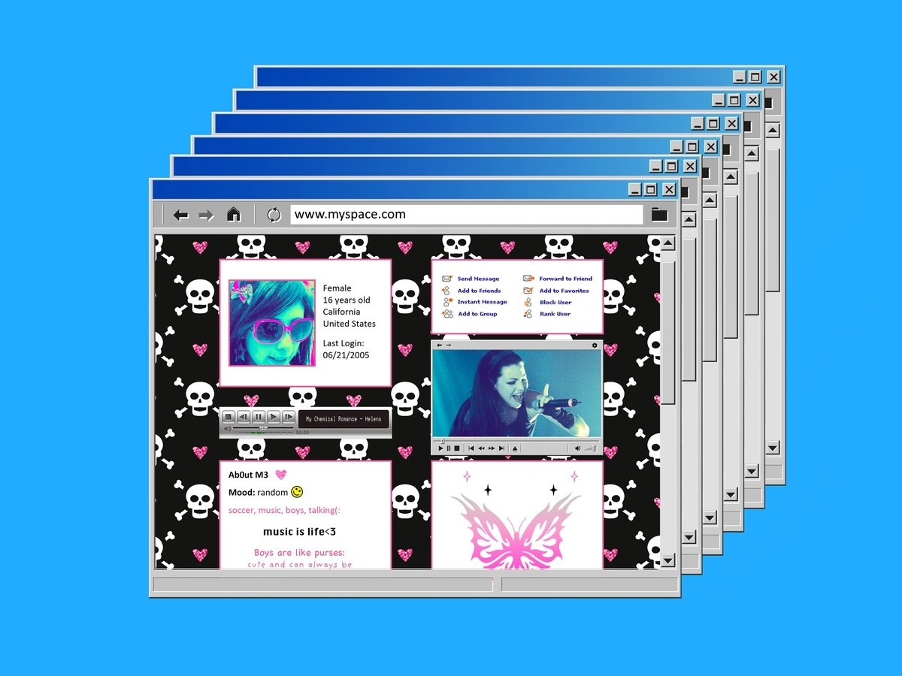

# What if Myspace Had It Right?

By Robin Winters · First published April 1, 2026 · Republished October 2, 2026

[Original LinkedIn edition](https://www.linkedin.com/pulse/what-myspace-had-right-robin-winters-ykksc/) · [Readable HTML edition](https://robinwinters.github.io/writing/what-if-myspace-had-it-right.html) · [Robin’s portfolio](https://robin.ac/)

Original wording, images and captions. Technical observations and opinions retain their original context.

Tom. Friend to all.

Let's talk about feeds.

How sticky are feeds? How personalized are feeds? How fast can feeds learn you? How well can feeds keep serving you content you didn’t ask for?

In terms of the Enshittification of UX across pretty much all modern social media maybe Feeds in general are part of the problem. But what would Social Media look like without a Feed? How would that even work?

Take a hike, Friendster, we're bringing it back to the real OG; Myspace.

To preface this, Myspace was far from perfect. It was ugly, launched the proliferation of up angle selfies, and fell out of vogue basically overnight.

However, Myspace centered UX around the User Profile instead of an Algorithmic Feed.

---

When Feeds became the center of Social Media UX user profiles became secondary and everything started bending toward whatever content keeps attention the longest and/or triggers the most repeat engagement (read as enragement). Once you do that, you start drifting toward rage bait and Boomer meme slop.

Shrimp Jesus, people. Shrimp Jesus.

I think Myspace, weirdly enough, had it right.

When you landed on someone’s page, you were entering their space. Their aesthetic, their vibe, their weird HTML decisions. It was messy, sometimes hideous, but it felt like a *person*.

That is wildly different from the experience most platforms train people into now, where interactions get routed through an opaque engagement engine.

That idea has been on my mind while building the social layer for ShowFlex.

ShowFlex isn't trying to become another generic social app with a bodybuilding skin wrapped around it - which sounds way grosser than I intended it to, but I'm leaving it in.

I’m more interested in building a social layer that feels tied to the person and their place inside the sport.

I don't want the center of gravity to be some endless feed, shoveling algorithmic sludge at people because being "Big mad" converts. I want the center of gravity to be the profile, which in a sport like bodybuilding  makes total sense. People care what your presence in the sport looks like, all of which being inherently profile native.

 

Avril Lavigne vibes. So complicated. So frustrated

A profile centric social layer also has a healthier shape to it.

It gives users somewhere to build from. It makes social interaction more legible and creates a stronger sense of place. It can make discovery feel more intentional instead of just reactive, and most importantly it reduces the amount of power handed to a hidden ranking engine that optimizes for emotional volatility.

So when I say I'm building a social media layer more like Myspace, I don't mean I'm are trying to cosplay 2006 internet aesthetics for nostalgia points - though I did find out Neo Y2K Futurism Aesthetic is making a come back. It's Rad. Look it up.

What I mean is that I'm taking seriously the idea that social products work better when people feel like they have a space and a visible relationship to a community, not just a stream.

So, maybe Myspace had something right. Not everything, but enough that it is worth revisiting the good parts and leaving the rest in the glitter gif covered tomb where it belongs.

Cue the Ooga chaka baby. Everything old is new again.

Build accordingly, and as always:

May the Force be with you.

🤘 Robin Winters
